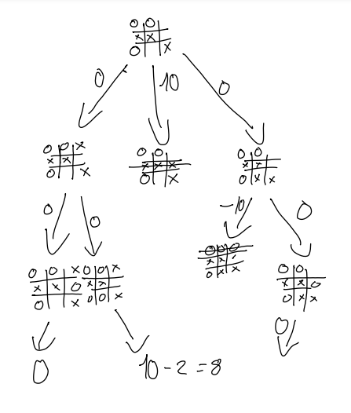

# <font size=20>Tictactoe</font>

**Developer**: Maxim Prestwich

**Project Goal**: Build and deploy a tictactoe web application from scratch using html, css and JavaScript

**Deployment Link**: https://maxim-pre.github.io/tictactoe/

# Technical Requirements

- Render a game board in the browser

- Switch turns between player1 and player 2

- Visually display which side won

- render a scoreboard in the browser to keep track of wins, losses and draws.

- Add different game modes such as pvp and player vs computer

- Make the game responsive to mobile phone screen sizes

# Technology

- Html
- Css
- JavaScript
- Version control software

  - **Git** software ran locally on my PC to keep track of project changes

  - **GitHub** cload based hosing service allowing me to manage the repository remotely

- Developer Tools
  - **Ubuntu** used to interact with project
  - **Visual Studio Code** IDE used to write code for this project
  - **Google Chrome** - Used developer tools for debugging and displaying application
  - **Pesticide** - Outlines rendered components which helped with formatting.

# Resources

- Google Fonts - https://fonts.google.com/specimen/Caveat
- Font awesome - https://fontawesome.com/search?q=x&o=r
- pixabay - https://pixabay.com/sound-effects/search/pencil/
- freepik - https://www.freepik.com/free-photos-vectors/lined-paper

# Implementing the Game logic

A Player can win by placing their icons on three adjacent tiles either:

- Horizontally
- Vertically
- Diagonally

To solive this I gave each box in the game board a unique value (0-8) and saved variable with all the win conditions. When A player selects a box, the box value is pushed to thier array.

```html
<div id="game-board">
  <div class="box" value="0"></div>
  <div class="box" value="1"></div>
  <div class="box" value="2"></div>
  <div class="box" value="3"></div>
  <div class="box" value="4"></div>
  <div class="box" value="5"></div>
  <div class="box" value="6"></div>
  <div class="box" value="7"></div>
  <div class="box" value="8"></div>
</div>

<!-- 
     0|1|2 
     3|4|5 
     6|7|8 
     -->
```

```javascript
winConditions = [
  //rows
  ["0", "1", "2"],
  ["3", "4", "5"],
  ["6", "7", "8"],
  //columns
  ["0", "3", "6"],
  ["1", "4", "7"],
  ["2", "5", "8"],
  //diagonals
  ["0", "4", "8"],
  ["2", "4", "6"],
];
```

With this setup I am easily able to assess the state of the game

```javascript
player1 = ["0", "4", "2", "1"];
player2 = ["2", "6", "7"];

for each condition in winConditions
    if every value in condition is in player1
        player 1 wins

    if every value in condition is in player2
        player 2 wins

if the total length of player1 + player2 is equal to 9
    the game is a draw

```

# implementing the Impossible AI

The impossible computer opponent was implemented using the **minimax** algorithm, a recursive algorithm for chosing the next best move.

The minimax algorithm is called whenever its the computers turn to pick and uses a simple scoring system to determine the strength of each move based on the potential outcomes.

```
scoringSystem {
    computerWins: 10
    playerWins: -10
    draw: 0
}
```



The computer takes the current board position as the root node on the tree and traverses down assessiing each possible outcome.

- The computer will always take the shortest distance to victory, so in the example above, even though there are two paths to victory the computer will select option 2
