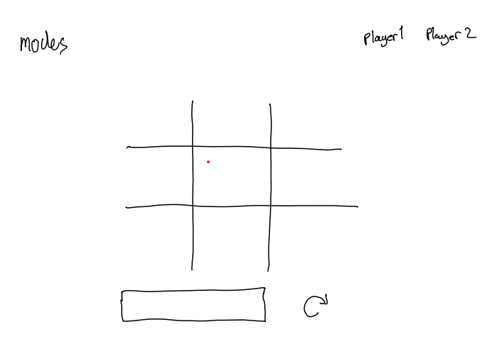

# <font size=20>Tictactoe</font>

**Developer**: Maxim Prestwich

**Project Goal**: In one week Build and deploy a tictactoe web application from scratch using html, css and JavaScript

**Deployment Link**: https://maxim-pre.github.io/tictactoe/

## Getting started

To access the code for the project on your machine run $git clone https://github.com/maxim-pre/tictactoe.git in you command line

## Timeframe

This was an individual project that was completed in one week as part of my software engineering bootcamp with General Assembly.

## Technology

- Html
- Css
- JavaScript
- Version control software

  - **Git** software ran locally on my PC to keep track of project changes

  - **GitHub** cload based hosing service allowing me to manage the repository remotely

- Developer Tools
  - **Ubuntu** used to interact with project
  - **Visual Studio Code** IDE used to write code for this project
  - **Google Chrome** - Used developer tools for debugging and displaying application
  - **Pesticide** - Outlines rendered components which helped with formatting.

## Technical Requirements

- Render a game board in the browser

- Switch turns between player1 and player 2

- Visually display which side won

- render a scoreboard in the browser to keep track of wins, losses and draws.

- Add different game modes such as pvp and player vs computer

- Make the game responsive to mobile phone screen sizes

## Resources

- Google Fonts - https://fonts.google.com/specimen/Caveat
- Font awesome - https://fontawesome.com/search?q=x&o=r
- pixabay - https://pixabay.com/sound-effects/search/pencil/
- freepik - https://www.freepik.com/free-photos-vectors/lined-paper

## Planning

Planning this project involved drawing a basic wireframe and writing user stories.



### UserStories

- As a user I should be able to reset a game so that I can cancel a match
- As a user I should be able to see a score board so that I can keep track of my wins and losses
- As a user I should be able to select from a list of game modes so I can decide if I would like to play with a friend or against the computer
- As a user I should be able to choose from a range of tokens so I don't have to always play as the crosses

## Build/Code process

<strong><font size=4>Implementing the game logic</font></strong>

A Player can win by placing their icons on three adjacent tiles either:

- Horizontally
- Vertically
- Diagonally

To solive this I gave each box in the game board a unique value (0-8) and saved variable with all the win conditions. When A player selects a box, the box value is pushed to thier array.

```html
<div id="game-board">
  <div class="box" value="0"></div>
  <div class="box" value="1"></div>
  <div class="box" value="2"></div>
  <div class="box" value="3"></div>
  <div class="box" value="4"></div>
  <div class="box" value="5"></div>
  <div class="box" value="6"></div>
  <div class="box" value="7"></div>
  <div class="box" value="8"></div>
</div>

<!-- 
     0|1|2 
     3|4|5 
     6|7|8 
     -->
```

```javascript
winConditions = [
  //rows
  ["0", "1", "2"],
  ["3", "4", "5"],
  ["6", "7", "8"],
  //columns
  ["0", "3", "6"],
  ["1", "4", "7"],
  ["2", "5", "8"],
  //diagonals
  ["0", "4", "8"],
  ["2", "4", "6"],
];
```

With this setup I am easily able to assess the state of the game

```javascript
player1 = ["0", "4", "2", "1"];
player2 = ["2", "6", "7"];

for each condition in winConditions
    if every value in condition is in player1
        player 1 wins

    if every value in condition is in player2
        player 2 wins

if the total length of player1 + player2 is equal to 9
    the game is a draw

```

<strong><font size=4>implementing the impossible AI</font></strong>

The impossible computer opponent was implemented using the **minimax** algorithm, a recursive algorithm for chosing the next best move.

The minimax algorithm is called whenever its the computers turn to pick and uses a simple scoring system to determine the strength of each move based on the potential outcomes.

```
scoringSystem {
    computerWins: 10
    playerWins: -10
    draw: 0
}
```


The computer takes the current board position as the root node on the tree and traverses down assessiing each possible outcome.

- The computer will always take the shortest distance to victory, so in the example above, even though there are two paths to victory the computer will select option 2

## Challenges

The most challenging part of this project for me was implementing the board animations. This was my first time working with css animations and went through two approaches. My first approach was to use pseudo elements (::before ::after) to draw lines around the boxes in the board grid. However, this caused the board lines to look uneven. My next approach was to make individual css classes for each of the board lines which looked much better.

```css
.line {
  position: absolute;
  width: 100%;
  height: 3px;
  background: #6f7378;
  box-shadow: 0 4px 6px -1px rgb(0 0 0 / 0.1), 0 2px 4px -2px rgb(0 0 0 / 0.1);
}
.horizontal-top {
  top: 33.3%;
  left: 0%;
}

.horizontal-bottom {
  transform-origin: top left;
  top: 66.6%;
  left: 100%;
  transform: rotate(180deg);
}

.vertical-left {
  transform-origin: top left;
  top: 100%;
  left: 33.3333%;
  transform: rotate(270deg);
}

.vertical-right {
  transform-origin: top left;
  top: 0%;
  left: 66.6666%;
  transform: rotate(90deg);
}

.activate-animation {
  animation: animate 0.5s ease-out forwards;
}

@keyframes animate {
  0% {
    width: 0%;
  }

  100% {
    width: 100%;
  }
}
```

## Wins

Im very happy with my implementation of computer opponent AI. I was able to implement an algorithm that's unbeatable

## Key Learnings/Takeaways

A key takeaway was the volume of code and time it takes to implement animations for a website. Subtle animations can improve the user experience but too much animation can be over-bearing. In the futre I would limit time spend on implementing animations and focus more on other areas of the project.

## Future improvements

- I would like to add the ability for users to save their scores to localhost so players can resume thier games at another time.
